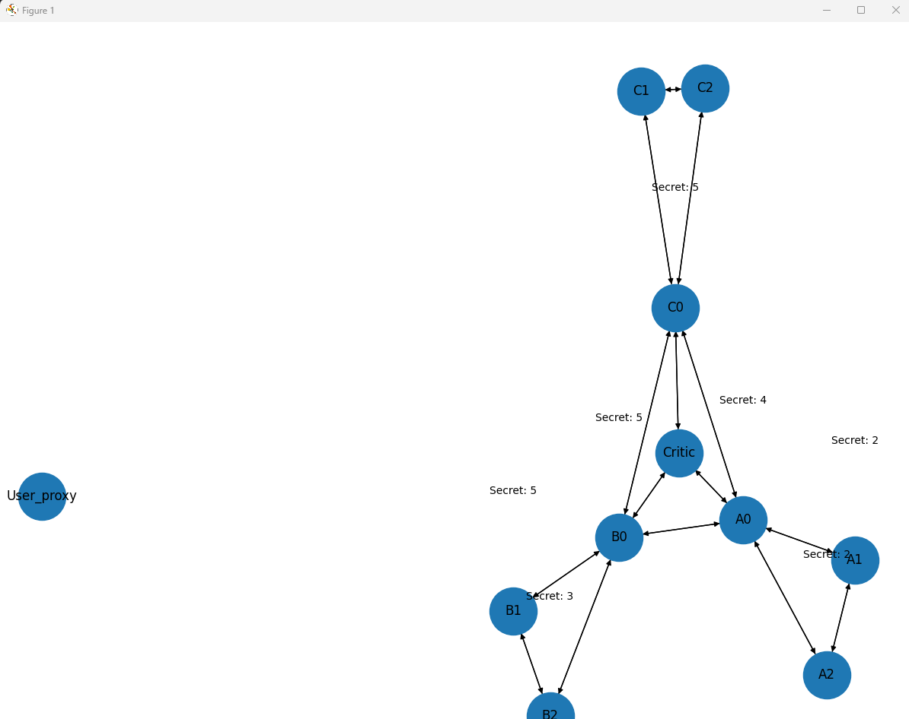

# Finite State Machine Group Chat with AutoGen 🤖🍫

This project simulates a finite state machine-based multi-agent system using OpenAI AutoGen.  
Agents communicate in turns to count chocolates, team leaders summarize counts, and a Critic validates protocol adherence.

---

## 🧠 Features
- Multi-agent chat with team structure (A, B, C)
- Strict speaker sequencing via FSM logic
- Visualized speaker transition graph
- Critic agent checks for rule violations

---

## 🖼 FSM Transition Graph



---

## 🗂 Project Structure
finite_state_machine_group_chat/
├── main.ipynb
├── .env
├── .gitignore
├── requirements.txt
├── README.md
└──  images/

---

## 📦 Setup Instructions

1. Clone the repository:
```bash
git clone https://github.com/SandeshGitHub2077/finite_state_machine_group_chat.git
cd finite_state_machine_group_chat
```
2. Install dependencies:
```bash
pip install -r requirements.txt
```
3. Add your OpenAI API key to a .env file:
```ini
OPENAI_API_KEY=sk-...
```
4. Run the simulation:
```bash
python main.ipynb
```
